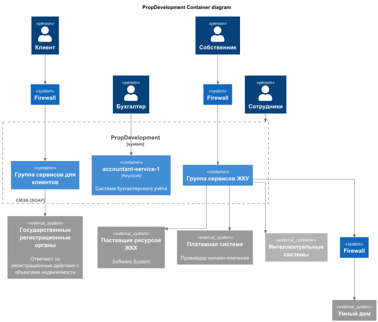
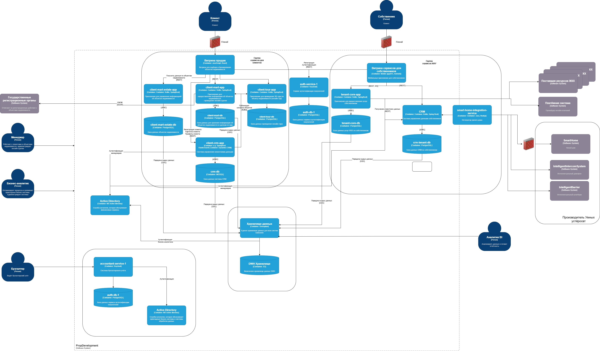

## Схема контекста
- 

### Схема контейнеров
- 
- [Sprint_5_Container_task_3.drawio.xml](Sprint_5_Container_task_3.drawio.xml)

### Список требований
- Безопасность
  - с использованием защищенного канала Https/TLS
  - обязательно Firewall, белый лист IP, при необходимости VPN
  - четкое описание передаваемых данных
    - минимальные
    - только то что касается самих устройств
    - вместо конкретных данных пользователя идентификаторы
  - биометрия хранится на стороне Партнера
  - все операции с Персональными данными согласно законодательства
    - согласие/отзыв пользователя,
    - процедура удаления данных при отзыве.
  - логирование всех запросов между партнерскими сервисами
  - все операции, связанные с Умным домом не должен быть связан и блокировать другие сервисы PropDevelopment

- Протоколы аутентификации и авторизации
  - обязательно MFA, OAuth
  - токены доступа
    - разрешение на пользование умным устройством для конкретного id пользователя
  - хранение правил доступа в CRM для пользователей с привязкой умных устройств к данным собственника

- Взаимодействие между системами внутренней и внешней SmartHome
  - Собственник заходит в мобильное приложение
    - авторизуется
  - переходит в меню Умного дома
    - проходит аутентификацию - биометрия либо MFA
    - при первом входе - дает согласие на обработку данных
  - При успешной авторизации Умного дома
    - открывается доступ к управлению доступными устройствами
    - также возможность добавить устройство Умного дома
  - Интелектуальный домофон, Интеллектуальный шлагбаум
    - функции идентичны по операциям
      - просмотр камеры онлайн
      - просмотр добавленных "биометрий" лиц
      - открытие домофона
    - Операции
      - ручное открытие
        - Пользователь нажимает открыть дверь/шлагбаум
          - Мобильное приложение образается к Интегратор умного дома (SmartHomeIntegrationService)
            - проверка токена и идентификация пользователя
            - сверка прав пользователя и домофона через CRM
            - формариует команду для SmartHome с идентификатором пользователя, домофона и командой
          - Интегратор умного дома (SmartHomeIntegrationService)  
                - получает OAuth-2 токен у SmartHome
                - делает запрос Интеллектуальный домофон/шлагбаум (IntelligentIntercomSystem/IntelligentBarrier)
                - логирует 
          - SmartHome
                - проверяет токен
                - принимает решение по запрошенной команде
                - возвращает результат
          
      - автоматическое открытие по биометрии/распозновании ГРЗ
        - камера домофона разпозанала лицо
          - отправляет запрос в Интеллектуальный домофон/шлагбаум (IntelligentIntercomSystem/IntelligentBarrier)
          - Интеллектуальный домофон/шлагбаум (IntelligentIntercomSystem/IntelligentBarrier) отправляет данные Интегратор умного дома (SmartHomeIntegrationService)
          - Интегратор умного дома (SmartHomeIntegrationService)
            - формирует команду на открытие
            - получает OAuth-2 токен у SmartHome
            - делает запрос Интеллектуальный домофон/шлагбаум (IntelligentIntercomSystem/IntelligentBarrier)
            - логирует
          - SmartHome
            - проверяет токен
            - принимает решение по запрошенной команде
            - возвращает результат
            
