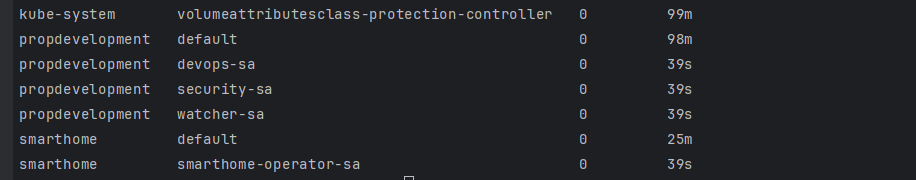
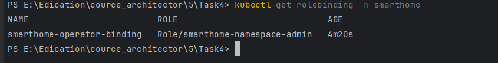
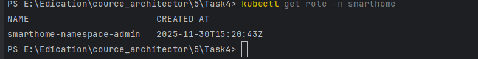

### Роли, права, группы пользователей
- [role-description.md](role-description.md)

### Запуск
- создать namespaces (propdevelopment, smarthome)
```
kubectl apply -f ./kuber/namespace.yaml
```

- создать пользователей
```
kubectl apply -f ./kuber/users.yaml
```

- применить роли
```
kubectl apply -f ./kuber/role.yaml
```

- связываем роли
```
kubectl apply -f ./kuber/role-binding.yaml
```

### Результаты
- все пользователи во всех namespace
```
kubectl get sa -A
```
- 

- посмотреть роли для smarthome
```
 kubectl get role -n smarthome   
```
- 

- посмотреть связки ролей 
```
kubectl get clusterrolebinding
```
- 