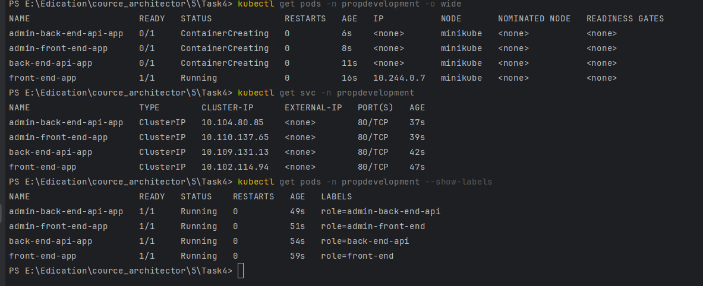

## Сервисы - поды
- создать
```
kubectl run front-end-app --image=nginx --labels role=front-end --expose --port 80 -n propdevelopment
kubectl run back-end-api-app --image=nginx --labels role=back-end-api --expose --port 80 -n propdevelopment
kubectl run admin-front-end-app --image=nginx --labels role=admin-front-end --expose --port 80 -n propdevelopment
kubectl run admin-back-end-api-app --image=nginx --labels role=admin-back-end-api --expose --port 80 -n propdevelopment
```
- проверить
```
kubectl get pods -n propdevelopment -o wide
kubectl get svc -n propdevelopment
kubectl get pods -n propdevelopment --show-labels
```
- 

## Настройка сетевого траффика между подами
- сначала запрещаем входящий траффик для back-end-api, admin-back-end-api
- и разрешаем ток тех, кто может "ходить" в свои сервисы 
```
kubectl apply -f ./kuber/skuf-politic.yaml
```

## Проверка
- создать тестовый Pod в том же naespace
```the windows
kubectl run test1 -n propdevelopment --rm -i -t --image=alpine -- sh

```
- изнутри Pod сделать запрос в back-end-api, 
```
wget -qO- --timeout=2 http://back-end-api-app
wget -qO- --timeout=2 http://front-end-app
```
- оба запроса выдали Nginx страничку, упссс...

## Копаем дальше

- удалил кластер, запустил с calico
```
minikube delete
minikube start --cni=calico
```

-  проверка Calico - в ответе за политики
```
kubectl get pods -n kube-system
```
- если есть едем дальше 

- создать namespaces (propdevelopment, smarthome)
```
kubectl apply -f ./kuber/namespace.yaml

```

-  снова создаем Pods
```
kubectl run front-end-app --image=nginx --labels role=front-end --expose --port 80 -n propdevelopment
kubectl run back-end-api-app --image=nginx --labels role=back-end-api --expose --port 80 -n propdevelopment
kubectl run admin-front-end-app --image=nginx --labels role=admin-front-end --expose --port 80 -n propdevelopment
kubectl run admin-back-end-api-app --image=nginx --labels role=admin-back-end-api --expose --port 80 -n propdevelopment

```

- применить политики
```
kubectl apply -f ./kuber/skuf-politic.yaml
```


- тестируем обрезание траффика
```the windows
kubectl run test1 -n propdevelopment --rm -i -t --image=alpine -- sh

wget -qO- --timeout=2 http://back-end-api-app
wget -qO- --timeout=2 http://front-end-app
```
- http://front-end-app - выдал HTMLку
- http://back-end-api-app - пусто, значит сработало (ошибок нет это важно)
